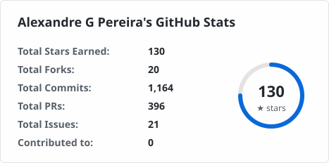
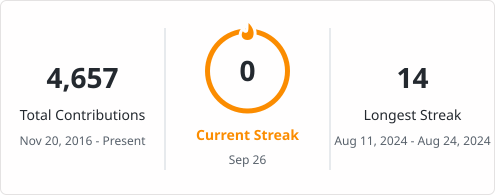
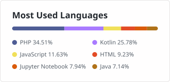

# Hi, I'm Alexandre 👋

Senior Mobile Software Engineer based in São Paulo, Brazil, with **14+ years** building mobile apps for Android and iOS — lately with a strong focus on **Kotlin Multiplatform**.

I've worked on fintech products at **Stone**, **SumUp** and **PicPay**.

## 🛠️ Tech

## 📊 GitHub Stats

<picture>
  <source media="(prefers-color-scheme: dark)" srcset="stats/stats-dark.svg">
  
</picture>

<picture>
  <source media="(prefers-color-scheme: dark)" srcset="stats/streak-dark.svg">
  
</picture>

<picture>
  <source media="(prefers-color-scheme: dark)" srcset="stats/langs-dark.svg">
  
</picture>

## 📫 Let's connect

